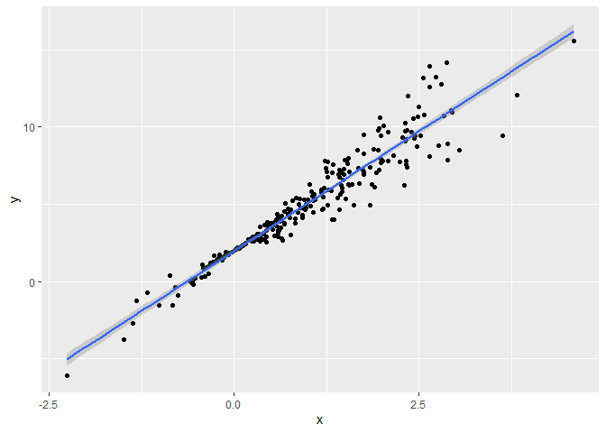
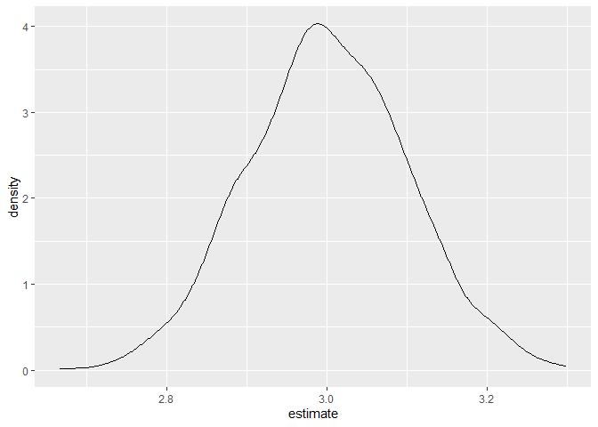

Bootstrap
================
Sarahy Martinez
2024-11-19

``` r
library(tidyverse)
```

    ## ── Attaching core tidyverse packages ──────────────────────── tidyverse 2.0.0 ──
    ## ✔ dplyr     1.1.4     ✔ readr     2.1.5
    ## ✔ forcats   1.0.0     ✔ stringr   1.5.1
    ## ✔ ggplot2   3.5.1     ✔ tibble    3.2.1
    ## ✔ lubridate 1.9.3     ✔ tidyr     1.3.1
    ## ✔ purrr     1.0.2     
    ## ── Conflicts ────────────────────────────────────────── tidyverse_conflicts() ──
    ## ✖ dplyr::filter() masks stats::filter()
    ## ✖ dplyr::lag()    masks stats::lag()
    ## ℹ Use the conflicted package (<http://conflicted.r-lib.org/>) to force all conflicts to become errors

``` r
library(modelr)
```

## Simulate Data

``` r
n_samp = 250

sim_df_const = 
  tibble(
    x = rnorm(n_samp, 1, 1),
    error = rnorm(n_samp, 0, 1),
    y = 2 + 3 * x + error
  )

sim_df_nonconst = sim_df_const %>% 
  mutate(
  error = error * .75 * x,
  y = 2 + 3 * x + error
)
```

Plot the data sets

``` r
sim_df_const %>% 
  ggplot(aes(x =x, y = y))+
  geom_point()+
  geom_smooth(method = "lm")
```

    ## `geom_smooth()` using formula = 'y ~ x'

<!-- -->

``` r
sim_df_nonconst %>% 
  ggplot(aes(x =x, y = y))+
  geom_point()+
  geom_smooth(method = "lm")
```

    ## `geom_smooth()` using formula = 'y ~ x'

<!-- -->

``` r
# can fit a linear regression but the key assumptions is fundamentally wrong. Assumptions we make to inference don't match so we will try to solve with bootstrap. Issue comes from figuring out the uncertainty
```

Fit linear regression

``` r
lm(y~x, data = sim_df_const) %>%  broom::tidy()
```

    ## # A tibble: 2 × 5
    ##   term        estimate std.error statistic   p.value
    ##   <chr>          <dbl>     <dbl>     <dbl>     <dbl>
    ## 1 (Intercept)     1.95    0.0874      22.3 4.54e- 61
    ## 2 x               3.07    0.0605      50.7 7.55e-133

``` r
lm(y~x, data = sim_df_nonconst) %>%  broom::tidy()
```

    ## # A tibble: 2 × 5
    ##   term        estimate std.error statistic   p.value
    ##   <chr>          <dbl>     <dbl>     <dbl>     <dbl>
    ## 1 (Intercept)     1.97    0.0873      22.5 5.55e- 62
    ## 2 x               3.10    0.0605      51.3 5.92e-134

``` r
# from our plots we can see that there is alot of uncertainty because of fanning out. We can get estimates and stand deviation if we were to make assumptions but we want to solve the issue of uncertainty by bootstrapping. Issue is that we also don't trust the uncertainty of the estimates.
```

## Draw one bootstrap sample

``` r
bootstrap_sample = function(df){   # write a function based on a df
  
  sample_frac(df, replace = TRUE) %>%  # we want the same size bc CI and variance are dependent on the sample size
  
  arrange(x)  # makes easier to look what is going on 
}
```

Check if df works

``` r
bootstrap_sample(sim_df_nonconst) %>% 
   ggplot(aes(x =x, y = y))+
  geom_point(alpha = .3)+
  geom_smooth(method = "lm")+
  ylim(-5,16)
```

    ## `geom_smooth()` using formula = 'y ~ x'

<!-- -->

``` r
# keep running and you'll get different regression lines, analysis is look at the plot but boostrap helps estimate the slope. 
```

Could also

``` r
bootstrap_sample(sim_df_nonconst) %>% 
   lm(y ~x, data = .) %>%
  broom::tidy()
```

    ## # A tibble: 2 × 5
    ##   term        estimate std.error statistic   p.value
    ##   <chr>          <dbl>     <dbl>     <dbl>     <dbl>
    ## 1 (Intercept)     1.89    0.0814      23.2 5.16e- 64
    ## 2 x               3.24    0.0574      56.5 1.37e-143

``` r
# not a cohesive way of analysis
```

## Many samples and analysis

``` r
boot_straps =
  tibble(
  strap_number = 1:1000,
  strap_sample = rerun( 1000, bootstrap_sample(sim_df_nonconst))
  )
```

    ## Warning: `rerun()` was deprecated in purrr 1.0.0.
    ## ℹ Please use `map()` instead.
    ##   # Previously
    ##   rerun(1000, bootstrap_sample(sim_df_nonconst))
    ## 
    ##   # Now
    ##   map(1:1000, ~ bootstrap_sample(sim_df_nonconst))
    ## This warning is displayed once every 8 hours.
    ## Call `lifecycle::last_lifecycle_warnings()` to see where this warning was
    ## generated.

``` r
# once we've gotten here with a dataframe we're right back in place. Can do the same things we did. 
```

Can I run my analysis on these?

``` r
boot_results =
    boot_straps %>% 
  mutate(
    
    models = map(.x = strap_sample, ~lm( y~x, data = .x)), 
    results = map(models, broom::tidy)
  ) %>% 
  select(strap_number, results) %>% 
  unnest(results)

# code works we have not double checked if they are different but we will trust. next we'll get a collection of results where we will map across models and just run broom tidy on each. 
```

What do I have now? Distribution of estimated intercept and slope. So
under repeated sampling that the variances are closer to the actual
variance if we were to compute the standard error ( standard deviation
of estimate) under repeated sampling.

``` r
boot_results %>% 
  group_by(term) %>% 
  summarize(
    
    mean_est = mean(estimate),
    sd_est = sd(estimate)
  )
```

    ## # A tibble: 2 × 3
    ##   term        mean_est sd_est
    ##   <chr>          <dbl>  <dbl>
    ## 1 (Intercept)     1.97 0.0557
    ## 2 x               3.10 0.0862

``` r
# giving the actual standard error and can we mimic this without making an assumption. Previously we have used a linear model that is a coincidence rather than what happens. If we compare bootstrap this is lower is we assumed constant variance which we have done in this example where we assume constant variance. 
```

Constructing a confidence interval and looking at distributions

``` r
boot_results %>% 
  filter( term == "x") %>% 
  ggplot(aes(x = estimate))+
  geom_density()
```

<!-- -->

``` r
#great bc data of repeated sampling and normally distributed 
```

Construct bootstrap CI

``` r
boot_results %>% 
  group_by(term) %>% 
  summarize(
    
   ci_lower = quantile(estimate, 0.025),
    ci_upper = quantile(estimate, 0.975)
  )
```

    ## # A tibble: 2 × 3
    ##   term        ci_lower ci_upper
    ##   <chr>          <dbl>    <dbl>
    ## 1 (Intercept)     1.86     2.08
    ## 2 x               2.94     3.27

``` r
# we get a CI based on repeated sampling and this gives about 2.91 and 3.31
```

## Bootstrap using modelr

use modelr to increase process of drawing repeated samples. Can we
simplify anything?

``` r
sim_df_nonconst %>% 
  bootstrap(1000,id = "strap_number") %>%   #resample and in cross validation we turned into a df, we can do the same thing before 
mutate(   # replaced id with id, we simply just renamed it without having to use the rename function
    
    models = map(.x = strap, ~lm( y~x, data = .x)), 
    results = map(models, broom::tidy)
  ) %>% 
  select(strap_number, results) %>% 
  unnest(results) %>%   
  group_by(term) %>% 
  summarize(
    
    mean_est = mean(estimate),
    sd_est = sd(estimate)
  )
```

    ## # A tibble: 2 × 3
    ##   term        mean_est sd_est
    ##   <chr>          <dbl>  <dbl>
    ## 1 (Intercept)     1.97 0.0536
    ## 2 x               3.10 0.0812

``` r
#boostrap says draw me a sample from this df, resample saves memory not new samples. In cross validation we used a df and mcgv but it doesn't work well so we'll do the same thing we've done. 
```

Bootrap works if assumptions are not met but What if your assumptions
are met? Does it do something reasonable?

Yes, they both work well

- if assumptions are true we can just use the linear models but we can
  also do this as well.
