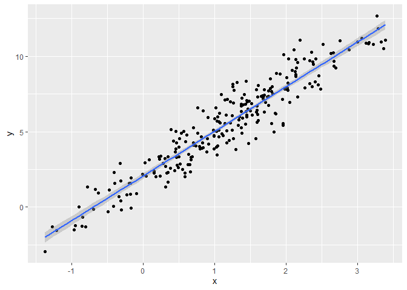
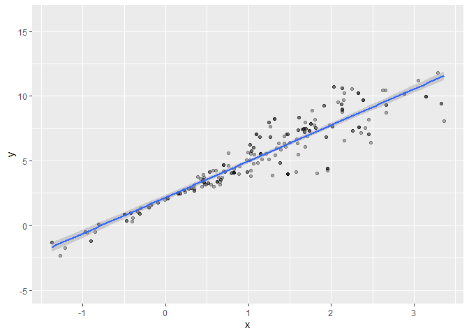

Bootstrap
================
Sarahy Martinez
2024-11-19

``` r
library(tidyverse)
```

    ## ── Attaching core tidyverse packages ──────────────────────── tidyverse 2.0.0 ──
    ## ✔ dplyr     1.1.4     ✔ readr     2.1.5
    ## ✔ forcats   1.0.0     ✔ stringr   1.5.1
    ## ✔ ggplot2   3.5.1     ✔ tibble    3.2.1
    ## ✔ lubridate 1.9.3     ✔ tidyr     1.3.1
    ## ✔ purrr     1.0.2     
    ## ── Conflicts ────────────────────────────────────────── tidyverse_conflicts() ──
    ## ✖ dplyr::filter() masks stats::filter()
    ## ✖ dplyr::lag()    masks stats::lag()
    ## ℹ Use the conflicted package (<http://conflicted.r-lib.org/>) to force all conflicts to become errors

``` r
library(modelr)
```

## Simulate Data

``` r
n_samp = 250

sim_df_const = 
  tibble(
    x = rnorm(n_samp, 1, 1),
    error = rnorm(n_samp, 0, 1),
    y = 2 + 3 * x + error
  )

sim_df_nonconst = sim_df_const %>% 
  mutate(
  error = error * .75 * x,
  y = 2 + 3 * x + error
)
```

Plot the data sets

``` r
sim_df_const %>% 
  ggplot(aes(x =x, y = y))+
  geom_point()+
  geom_smooth(method = "lm")
```

    ## `geom_smooth()` using formula = 'y ~ x'

<!-- -->

``` r
sim_df_nonconst %>% 
  ggplot(aes(x =x, y = y))+
  geom_point()+
  geom_smooth(method = "lm")
```

    ## `geom_smooth()` using formula = 'y ~ x'

<!-- -->

``` r
# can fit a linear regression but the key assumptions is fundamentally wrong. Assumptions we make to inference don't match so we will try to solve with bootstrap. Issue comes from figuring out the uncertainty
```

Fit linear regression

``` r
lm(y~x, data = sim_df_const) %>%  broom::tidy()
```

    ## # A tibble: 2 × 5
    ##   term        estimate std.error statistic   p.value
    ##   <chr>          <dbl>     <dbl>     <dbl>     <dbl>
    ## 1 (Intercept)     1.96    0.0929      21.1 3.66e- 57
    ## 2 x               2.96    0.0641      46.2 6.79e-124

``` r
lm(y~x, data = sim_df_nonconst) %>%  broom::tidy()
```

    ## # A tibble: 2 × 5
    ##   term        estimate std.error statistic   p.value
    ##   <chr>          <dbl>     <dbl>     <dbl>     <dbl>
    ## 1 (Intercept)     2.12    0.0891      23.7 8.17e- 66
    ## 2 x               2.80    0.0615      45.5 1.90e-122

``` r
# from our plots we can see that there is alot of uncertainty because of fanning out. We can get estimates and stand deviation if we were to make assumptions but we want to solve the issue of uncertainty by bootstrapping. Issue is that we also don't trust the uncertainty of the estimates.
```

## Draw one bootstrap sample

``` r
bootstrap_sample = function(df){   # write a function based on a df
  
  sample_frac(df, replace = TRUE) %>%  # we want the same size bc CI and variance are dependent on the sample size
  
  arrange(x)  # makes easier to look what is going on 
}
```

Check if df works

``` r
bootstrap_sample(sim_df_nonconst) %>% 
   ggplot(aes(x =x, y = y))+
  geom_point(alpha = .3)+
  geom_smooth(method = "lm")+
  ylim(-5,16)
```

    ## `geom_smooth()` using formula = 'y ~ x'

<!-- -->

``` r
# keep running and you'll get different regression lines, analysis is look at the plot but boostrap helps estimate the slope. 
```

Could also

``` r
bootstrap_sample(sim_df_nonconst) %>% 
   lm(y ~x, data = .) %>%
  broom::tidy()
```

    ## # A tibble: 2 × 5
    ##   term        estimate std.error statistic   p.value
    ##   <chr>          <dbl>     <dbl>     <dbl>     <dbl>
    ## 1 (Intercept)     2.06    0.0864      23.8 5.31e- 66
    ## 2 x               2.80    0.0577      48.6 1.09e-128

``` r
# not a cohesive way of analysis
```
