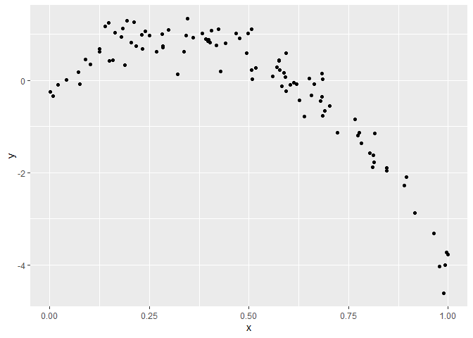
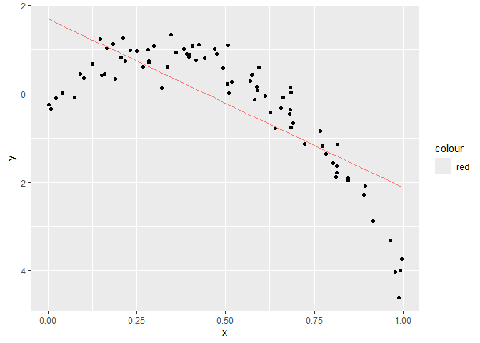
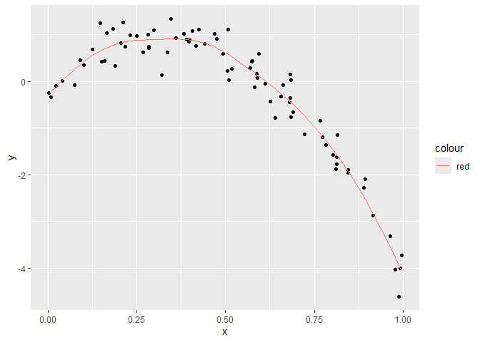
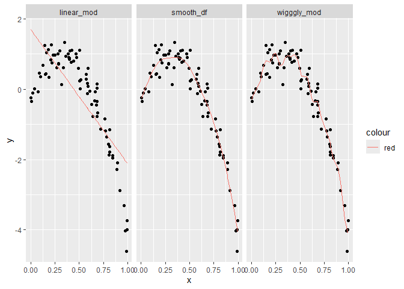

Cross Validation
================
Sarahy Martinez
2024-11-14

``` r
library(tidyverse)
```

    ## ── Attaching core tidyverse packages ──────────────────────── tidyverse 2.0.0 ──
    ## ✔ dplyr     1.1.4     ✔ readr     2.1.5
    ## ✔ forcats   1.0.0     ✔ stringr   1.5.1
    ## ✔ ggplot2   3.5.1     ✔ tibble    3.2.1
    ## ✔ lubridate 1.9.3     ✔ tidyr     1.3.1
    ## ✔ purrr     1.0.2     
    ## ── Conflicts ────────────────────────────────────────── tidyverse_conflicts() ──
    ## ✖ dplyr::filter() masks stats::filter()
    ## ✖ dplyr::lag()    masks stats::lag()
    ## ℹ Use the conflicted package (<http://conflicted.r-lib.org/>) to force all conflicts to become errors

``` r
library(modelr)
library(mgcv)
```

    ## Loading required package: nlme
    ## 
    ## Attaching package: 'nlme'
    ## 
    ## The following object is masked from 'package:dplyr':
    ## 
    ##     collapse
    ## 
    ## This is mgcv 1.9-1. For overview type 'help("mgcv-package")'.

``` r
nonlin_df = 
  tibble(
    
    id = 1:100,
    x = runif(100, 0, 1),
    y = 1- 10 * (x - .3)^2 + rnorm( 100, 0, .3)
  )

# we are simulating data here nonlinear bc looking at the data it is non-lin look at the graph
```

``` r
nonlin_df %>% 
  ggplot(aes(x =x, y =y))+
  geom_point()
```

<!-- -->

``` r
#see that the data is nonlinear and if we fit a line it wont be too well and we know its a square term but we wouldn't know bc we have to fit the curvature. We want to fit something that isn't too sensitive to the outliers
```

## Cross validation by hand

- construct a training set and testing set

``` r
# get training and testing datasets 

#first the train df that samples a fix  number of dataframes

train_df = sample_n(nonlin_df, size= 80)  # has 80 rows and we want the 20 nonlinear that dont appear in training 


test_df = anti_join(nonlin_df, train_df, by = "id") # now this contains the missing data that nots in the train
```

Fit three models

``` r
linear_mod = lm( y~x, data = train_df)
smooth_df = gam( y~s(x), data = train_df) # gonna try to make a smooth df
wigggly_mod= gam(y~s(x, k =20), sp = 10e-6, data = train_df)  # now we want it to chase every datapoint and tell it how complex we want the model to be
```

lets see what we just did

``` r
train_df %>% 
  add_predictions(linear_mod) %>% 
  ggplot(aes(x = x, y = y))+
  geom_point()+
  geom_line(aes(y = pred, color = "red"))  # we see that the line that fits is the best it can do and the linear model does this but if we updated and fit the smooth it qill do better
```

<!-- -->

``` r
train_df %>% 
  add_predictions(smooth_df) %>% 
  ggplot(aes(x = x, y = y))+
  geom_point()+
  geom_line(aes(y = pred, color = "red")) 
```

<!-- -->

``` r
train_df %>% 
  add_predictions(linear_mod) %>% 
  ggplot(aes(x = x, y = y))+
  geom_point()+
  geom_line(aes(y = pred, color = "red")) # wiggly will chase every point and make bad preditions bc chasing too much
```

<!-- -->

We can also add model multiple model predictions onto one

``` r
train_df %>% 
  gather_predictions(linear_mod, smooth_df, wigggly_mod) %>%  #instead 80 rows we have 240 and these the predictions for each model
  ggplot(aes(x = x, y = y))+
  geom_point()+
  geom_line(aes(y = pred, color = "red"))+
  facet_grid(. ~ model)
```

<!-- -->

``` r
# gather predictions for fitting the models simultaneously 
```
