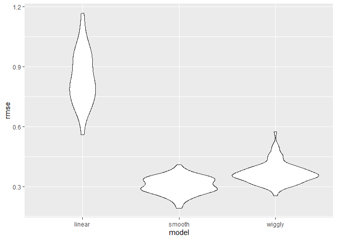

Cross Validation
================
Sarahy Martinez
2024-11-14

``` r
library(tidyverse)
```

    ## ── Attaching core tidyverse packages ──────────────────────── tidyverse 2.0.0 ──
    ## ✔ dplyr     1.1.4     ✔ readr     2.1.5
    ## ✔ forcats   1.0.0     ✔ stringr   1.5.1
    ## ✔ ggplot2   3.5.1     ✔ tibble    3.2.1
    ## ✔ lubridate 1.9.3     ✔ tidyr     1.3.1
    ## ✔ purrr     1.0.2     
    ## ── Conflicts ────────────────────────────────────────── tidyverse_conflicts() ──
    ## ✖ dplyr::filter() masks stats::filter()
    ## ✖ dplyr::lag()    masks stats::lag()
    ## ℹ Use the conflicted package (<http://conflicted.r-lib.org/>) to force all conflicts to become errors

``` r
library(modelr)
library(mgcv)
```

    ## Loading required package: nlme
    ## 
    ## Attaching package: 'nlme'
    ## 
    ## The following object is masked from 'package:dplyr':
    ## 
    ##     collapse
    ## 
    ## This is mgcv 1.9-1. For overview type 'help("mgcv-package")'.

``` r
nonlin_df = 
  tibble(
    
    id = 1:100,
    x = runif(100, 0, 1),
    y = 1- 10 * (x - .3)^2 + rnorm( 100, 0, .3)
  )

# we are simulating data here nonlinear bc looking at the data it is non-lin look at the graph
```

``` r
nonlin_df %>% 
  ggplot(aes(x =x, y =y))+
  geom_point()
```

<!-- -->

``` r
#see that the data is nonlinear and if we fit a line it wont be too well and we know its a square term but we wouldn't know bc we have to fit the curvature. We want to fit something that isn't too sensitive to the outliers
```

## Cross validation by hand

- construct a training set and testing set

``` r
# get training and testing datasets 

#first the train df that samples a fix  number of dataframes

train_df = sample_n(nonlin_df, size= 80)  # has 80 rows and we want the 20 nonlinear that dont appear in training 


test_df = anti_join(nonlin_df, train_df, by = "id") # now this contains the missing data that nots in the train
```

Fit three models

``` r
linear_mod = lm( y~x, data = train_df)
smooth_df = gam( y~s(x), data = train_df) # gonna try to make a smooth df
wigggly_mod= gam(y~s(x, k =20), sp = 10e-6, data = train_df)  # now we want it to chase every datapoint and tell it how complex we want the model to be
```

lets see what we just did

``` r
train_df %>% 
  add_predictions(linear_mod) %>% 
  ggplot(aes(x = x, y = y))+
  geom_point()+
  geom_line(aes(y = pred, color = "red"))  # we see that the line that fits is the best it can do and the linear model does this but if we updated and fit the smooth it qill do better
```

<!-- -->

``` r
train_df %>% 
  add_predictions(smooth_df) %>% 
  ggplot(aes(x = x, y = y))+
  geom_point()+
  geom_line(aes(y = pred, color = "red")) 
```

<!-- -->

``` r
train_df %>% 
  add_predictions(linear_mod) %>% 
  ggplot(aes(x = x, y = y))+
  geom_point()+
  geom_line(aes(y = pred, color = "red")) # wiggly will chase every point and make bad preditions bc chasing too much
```

<!-- -->

We can also add model multiple model predictions onto one

``` r
train_df %>% 
  gather_predictions(linear_mod, smooth_df, wigggly_mod) %>%  #instead 80 rows we have 240 and these the predictions for each model
  ggplot(aes(x = x, y = y))+
  geom_point()+
  geom_line(aes(y = pred, color = "red"))+
  facet_grid(. ~ model)
```

<!-- -->

``` r
# gather predictions for fitting the models simultaneously 
```

Looking at prediction accuracy

``` r
rmse(linear_mod, test_df) #computes a root mean square  error 
```

    ## [1] 0.7137613

``` r
rmse(smooth_df, test_df) # does the best for the particuar training and testing split
```

    ## [1] 0.3781075

``` r
rmse(wigggly_mod, test_df) # chases noise
```

    ## [1] 0.3618895

Cross validation picks among the three models and smooth does the best,
can’t think that it’s nested within the model We have comparing models
like aic , not a p-value but how do we compare models like prediction
accuracy to say one model compares to other predictions.

## Cross validation using the `modelr` package

``` r
# we can do repeats and write a function to repeat and modlr generates the testing of training data sets. 

cv_df = 
  crossv_mc(nonlin_df, 100)  # here we have train, test and id 
```

What is happening here? We are resampling and drawing samples that
already exist

``` r
cv_df %>% 
  pull(train) %>% # pull the train column
  .[[1]] %>%  # we are checking the first element of this list  
  as_tibble()  # force this to be a tibble 
```

    ## # A tibble: 79 × 3
    ##       id     x      y
    ##    <int> <dbl>  <dbl>
    ##  1     1 0.112  1.31 
    ##  2     2 0.793 -1.66 
    ##  3     3 0.548  0.668
    ##  4     4 0.992 -3.62 
    ##  5     5 0.220  1.10 
    ##  6     6 0.640 -0.397
    ##  7     7 0.239  1.32 
    ##  8     8 0.816 -1.32 
    ##  9     9 0.671 -0.174
    ## 10    10 0.715 -0.440
    ## # ℹ 69 more rows

``` r
cv_df %>% pull(test) %>% .[[1]] %>%as_tibble() # resulting 7 are here 
```

    ## # A tibble: 21 × 3
    ##       id      x      y
    ##    <int>  <dbl>  <dbl>
    ##  1    17 0.327   0.950
    ##  2    20 0.449   0.845
    ##  3    27 0.529   0.471
    ##  4    29 0.878  -1.95 
    ##  5    30 0.0427  0.298
    ##  6    31 0.0769  0.162
    ##  7    36 0.972  -3.97 
    ##  8    38 0.907  -3.03 
    ##  9    44 0.829  -1.42 
    ## 10    47 0.498   0.330
    ## # ℹ 11 more rows

``` r
# structure of the cross is to have two list columns side by side, the training for a particular split, testing for a particular split , id for the split and then same thing etc. Instead of trying to store as hundred dataset, just stored as row numbers but we will convert back to a tibble. 
```

``` r
cv_df =
  cv_df %>% 
  mutate(
    train = map(train, as_tibble),
    test = map(test, as_tibble))
 # re-sample objects and you can do that in lm but not mcgv gam function so we have to do this step
```

Lets try to fit models and get RMSE’s for them

``` r
cv_df = cv_df %>% 
  mutate(
    linear_mod = map(.x = train, ~lm(y ~ x, data = .x)), # we want to fit for each element so we will map across
    smooth_mod = map(.x = train, ~gam(y ~ s(x), data = .x)),  # made new variables linear, smooth etc and place below
    wiggly_mod = map(.x = train, ~gam(y ~ s(x, k = 30), sp = 10e-6, data = .x))
  ) %>%  #produces a list column with linear models  # we want to do a similar thing with the smooth and wiggly 
mutate(
   rmse_linear = map2_dbl( .x = linear_mod, .y = test, ~rmse(model = .x, data = .y)),
   rmse_smooth = map2_dbl( .x = smooth_mod,  .y = test, ~rmse(model = .x, data = .y)),
   rmse_wiggly = map2_dbl( .x = wiggly_mod,.y = test, ~rmse(model = .x, data = .y))
  #map2_dbl just gives the numbers, map2 gives the list
)


# in general which model is better?
```

What do the results say about model choice?

``` r
cv_df %>% 
  select(starts_with("rmse")) %>% 
  pivot_longer(
    everything(),
    names_to = "model",
    values_to = "rmse",
    names_prefix = "rmse_"
  ) %>% 
  ggplot(aes(x = model, y=rmse))+ 
  geom_violin()  # we have a distribution across 100 training sets and looks like linear model makes worse predictions , the smooth and wiggly are on the right track and then smooth model is doing the best. 
```

<!-- -->

Compute the averages

``` r
cv_df %>% 
  select(starts_with("rmse")) %>% 
  pivot_longer(
    everything(),
    names_to = "model",
    values_to = "rmse",
    names_prefix = "rmse_"
  ) %>% 
  group_by(model) %>% 
  summarize(avg_rmse = mean(rmse))
```

    ## # A tibble: 3 × 2
    ##   model  avg_rmse
    ##   <chr>     <dbl>
    ## 1 linear    0.834
    ## 2 smooth    0.335
    ## 3 wiggly    0.405
